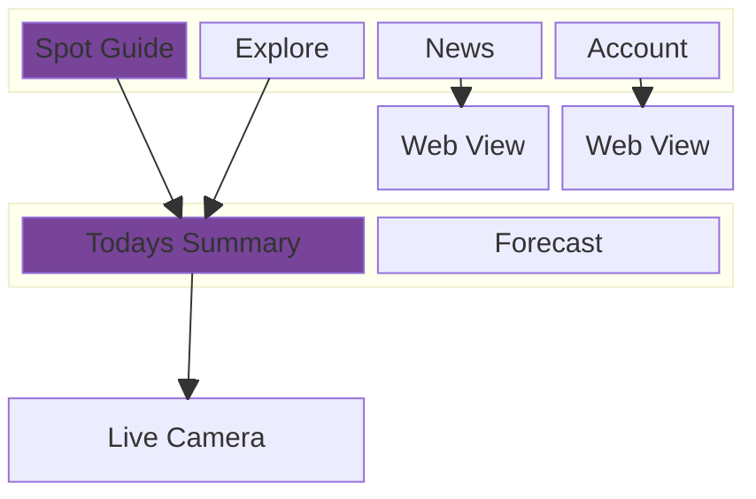

# Navigation of Screens

Each block represents one screen of the app. Blocks in a section represent tabbed navigation, where the highlighted block is the default tab.

```mermaid
block-beta
columns 4

block:Home:4
    Spots["Spot Guide"]
    Explore
    News
    Account
end

space:2
News-->Article["Web View"]
Account-->WebView["Web View"]

block:Beach:4
    Spots-->Today
    Explore-->Today
    Today["Todays Summary"]
    Forecast["Forecast"]
end

space:4
Camera:2
Today-->Camera["Live Camera"]

style Spots fill:#749
style Today fill:#749
```
